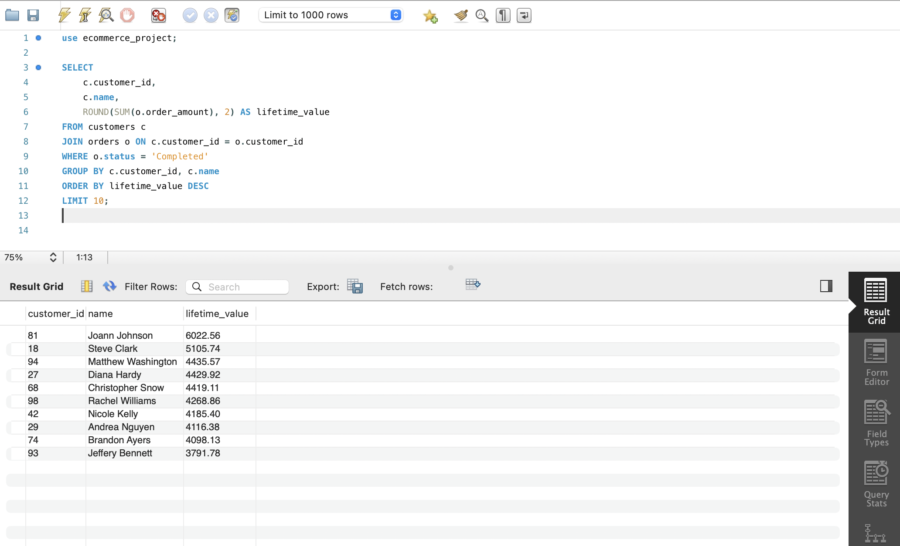

# ecommerce-sql-case-study
SQL project analyzing e-commerce customer behavior using MySQL
# 🛒 E‑commerce SQL Case Study – Portfolio Project

*Analyze fictional e‑commerce data in MySQL to showcase advanced SQL skills for data‑analyst roles.*

---

##  Objectives

| # | Business Question | SQL Techniques Used |
|---|-------------------|---------------------|
| 1 | Who are our most valuable customers? (CLV) | `JOIN`, `SUM`, `GROUP BY` |
| 2 | Which customers may churn (inactive 90+ days)? | `MAX`, `DATEDIFF`, `HAVING` |
| 3 | What are the top‑selling products each month? | **Window functions** `RANK()` |
| 4 | How well do signup cohorts retain over time? | **CTEs**, date functions |

---

## 📂 Project Structure
ecommerce-sql-case-study/ ├── data/ ← 4 CSV files (generated with Python + Faker) ├── sql/ │  ─ schema.sql ← CREATE TABLE script │ ─ analysis_queries.sql ├ ─ screenshots/  Results


##  Tech Stack

- **MySQL 8.0** (queries run in MySQL Workbench or CLI)
- Git & GitHub for version control
- Python (only for dataset generation)
- Optional: Excel / Google Sheets / Tableau for quick charts

---

##  Quick Start

```bash
# 1  Clone the repo
git clone https://github.com/<your-username>/ecommerce-sql-case-study.git
cd ecommerce-sql-case-study

# 2  In MySQL Workbench:
#    – Run sql/schema.sql  (creates tables)
#    – Import each CSV from data/ into its matching table

# 3  Execute queries from sql/analysis_queries.sql

-- Top 10 customers by lifetime value
SELECT c.customer_id,
       ROUND(SUM(o.order_amount),2) AS lifetime_value
FROM customers c
JOIN orders o USING (customer_id)
WHERE o.status = 'Completed'
GROUP BY c.customer_id
ORDER BY lifetime_value DESC
LIMIT 10;
```

### Customer Lifetime Value (Top 10)


