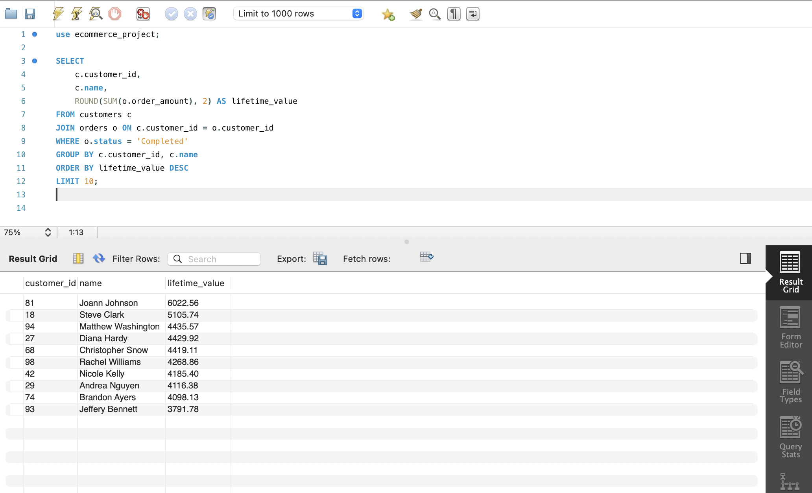
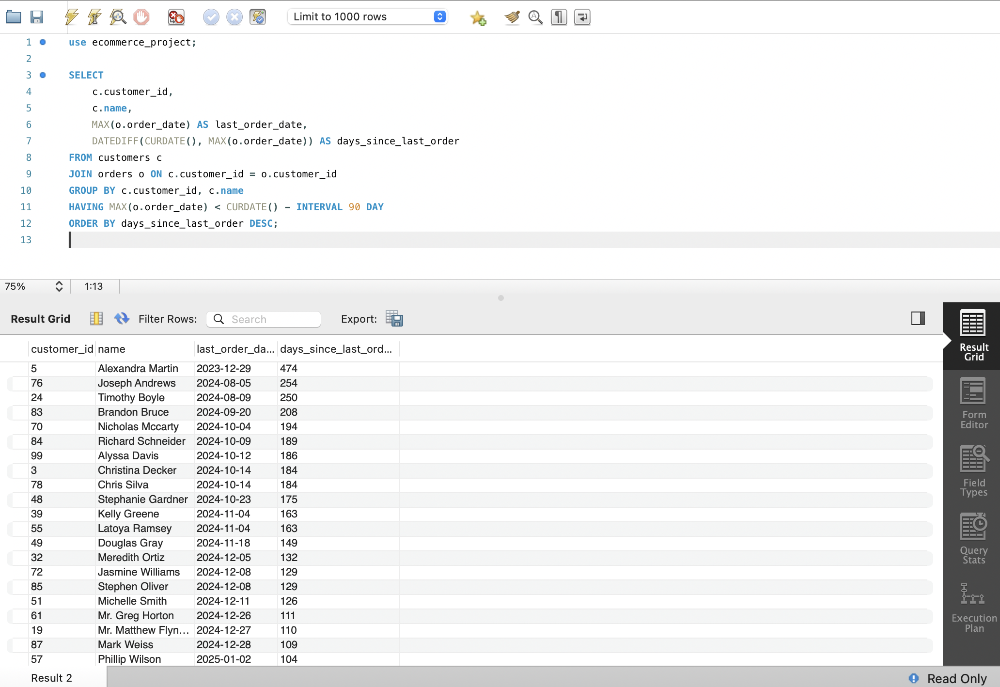

# E-Commerce SQL Case Study

A portfolio project analyzing fictional e-commerce customer behavior using MySQL, designed to demonstrate advanced SQL proficiency for data analyst roles.

---

## Objectives

| # | Business Question | SQL Techniques |
|---|-------------------|----------------|
| 1 | Who are our most valuable customers? (Customer Lifetime Value) | `JOIN`, `SUM`, `GROUP BY` |
| 2 | Which customers are at risk of churning (inactive 90+ days)? | `MAX`, `DATEDIFF`, `HAVING` |
| 3 | What are the top-selling products each month? | Window functions — `RANK()` |
| 4 | How do signup cohorts retain over time? | CTEs, date functions |

---

## Project Structure
ecommerce-sql-case-study/
├── data/                    # 4 CSV files generated with Python + Faker
├── sql/
│   ├── schema.sql           # CREATE TABLE scripts
│   └── analysis_queries.sql # All analysis queries
└── screenshots/             # Query result screenshots

## Tech Stack

- **MySQL 8.0** — queries run in MySQL Workbench or CLI
- **Git & GitHub** — version control
- **Python** — dataset generation only
- **Excel / Tableau** *(optional)* — visualization

---

## Quick Start

```bash
# 1. Clone the repository
git clone https://github.com/<your-username>/ecommerce-sql-case-study.git
cd ecommerce-sql-case-study
```

Then, in MySQL Workbench:
1. Run `sql/schema.sql` to create the tables
2. Import each CSV from `data/` into its corresponding table
3. Execute the queries in `sql/analysis_queries.sql`

---

## Analysis Queries

### 1. Customer Lifetime Value (Top 10)

```sql
SELECT c.customer_id,
       ROUND(SUM(o.order_amount), 2) AS lifetime_value
FROM customers c
JOIN orders o USING (customer_id)
WHERE o.status = 'Completed'
GROUP BY c.customer_id
ORDER BY lifetime_value DESC
LIMIT 10;
```



---

### 2. Churn Risk — Customers Inactive for 90+ Days

```sql
SELECT c.customer_id,
       MAX(o.order_date)                            AS last_order_date,
       DATEDIFF(CURDATE(), MAX(o.order_date))       AS days_since_last_order
FROM customers c
JOIN orders o USING (customer_id)
GROUP BY c.customer_id
HAVING MAX(o.order_date) < CURDATE() - INTERVAL 90 DAY;
```



---

## Author

**Kanak Yadav**
[GitHub](https://github.com/kanak2208) · [LinkedIn](https://linkedin.com/in/kanakyadav22)
